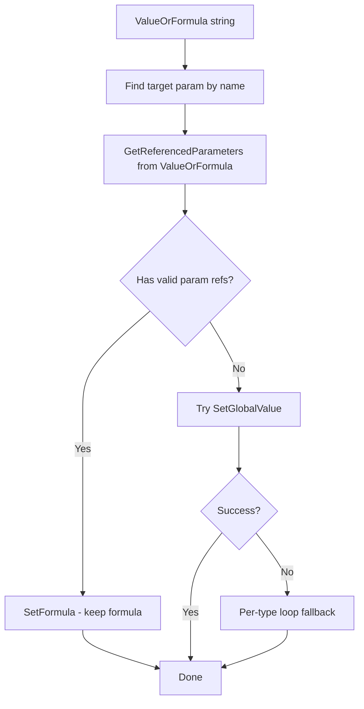

# Consolidate SetParam Operations

## Problem Summary

Currently there are 4 overlapping operations with subtle differences:

- `SetParamValueAsValue` - uses SetGlobalValue (formula trick)
- `SetParamValueAsFormula` - sets value AS a formula that stays
- `SetParamFormula` - sets actual formulas
- `SetParamValuePerType` - loops through types to set values

This creates maintenance burden and unclear intent.

## Design

### Core Concept

We will make an OperationGroup that accepts two nearly identical data models.


### New Settings Models

Two focused models, one settings class containing both:

```csharp
// For global values or formulas (with per-type fallback on failure)
public record SetParamModel {
    public required string Name { get; init; }
    public string ValueOrFormula { get; init; } = null;
    
    // For optional creation
    public ForgeTypeId PropertiesGroup { get; init; } = new("");
    public ForgeTypeId DataType { get; init; } = null;
    public bool IsInstance { get; init; } = true;
}

// For explicit per-type values (different value per named type)
public record SetParamPerTypeModel {
    public required string Name { get; init; }
    public Dictionary<string, string> ValuesPertype { get; init; } = new();  // TypeName → Value
    
    // For optional creation
    public ForgeTypeId PropertiesGroup { get; init; } = new("");
    public ForgeTypeId DataType { get; init; } = null;
    public bool IsInstance { get; init; } = true;
}

public class AddAndSetParamsSettings : IOperationSettings {
    public bool Enabled { get; init; } = true;
    public bool OverrideExistingValues { get; init; } = true;
    public bool CreateIfMissing { get; init; } = false;
    
    public List<SetParamModel> Parameters { get; init; } = [];
    public List<SetParamPerTypeModel> PerTypeParameters { get; init; } = [];
}
```

**Example JSON usage:**

```json
{
  "AddAndSetParams": {
    "CreateIfMissing": true,
    "Parameters": [
      { "Name": "PE_G___Model", "ValueOrFormula": "Width * 2" }, // evaluates to this formula string
      { "Name": "PE_G___Manufacturer", "ValueOrFormula": "ACME Corp" } // evaluate to this string
      { "Name": "Example Param", "ValueOrFormula": "\"PE_G___Model\"" } // evaluate to the string PE_G___Model
      { "Name": "PE_E_ApparentPower", "ValueOrFormula": "PE_E___Voltage * PE_E___MCA * 0.8 * if(PE_E___NumberOfPoles = 3, sqrt(3), 1)" } // evaluate this formula string
      { "Name": "PE_G___Width1", "ValueOrFormula": "10 * 2" } // should evaluate to 20 
      { "Name": "PE_G___Length1", "ValueOrFormula": "11.5" } // this and below should do same
      { "Name": "PE_G___Height1", "ValueOrFormula": "11.5\"" }
      { "Name": "PE_G___MOCP", "ValueOrFormula": "40" } // this and below should both attempt to set mocp to 40
      { "Name": "PE_G___MOCP", "ValueOrFormula": "40 A" }
    ],
    "PerTypeParameters": [
      { 
        "Name": "PE_E___MCA", 
        "PerTypeValues": { "mistubishi XXX 120V": "10 A", "mitsubishi XXX 208V": "11", "mitsubishi XXX 208V /w branch box": "20", "240V": "15" }
      },
      { 
        "Name": "PE_E___MCA", 
        "PerTypeValues": { "mistubishi XXX 120V": "10", "mitsubishi XXX 208V": "11", "mitsubishi XXX 208V /w branch box": "11 + 9", "240V": "15" }
      }
      { 
        "Name": "PE_M_Fan_Filter", 
        "PerTypeValues": { "mistubishi XXX 120V": "MERV10", "mitsubishi XXX 208V": "MERV10", "mitsubishi XXX 208V /w branch box": "MERV10", "240V": "MERV13" }
      },
      
    ]
  }
}
```

#### ValueOrFormula

A single user-set `ValueOrFormula` string with **context-aware auto-detection**:

The detection should prioritize detecting parameters but should also consider the target parameter's **StorageType** to avoid false positives:

- Use FormulaUtils `.GetReferencedParameters()` to first get actual FamilyParameter references if they exist in the formula
- If no referenced params exist, set the value (use `SetGlobalValue` with per-type fallback, using a `TypeOperation` and `SetValue`). the SetGlobalValue approach can be very simple. However the setvalue approach will need to account for revit units
    - If target param is StorageType.Int/Double, try detect int/double-only
    - A StorageType.String param can be set to`"Hello"` the plain user-set value. this is the catch-all
        - document and implement simple detection for ""-wrapped strings. This we can always interpret as a string value to set. this is a useful backdoor of sorts and aligns with convention
- A Double param with `"120"` should be treated as a numeric value, not a formula

This leverages existing `FamilyParameterFormulaUtils` which already validates parameter references against the FamilyManager.



#### ValuesPerType

A single user-set `ValuesPertype` string that uses the same context aware core as detailed above. Note that this means this context-aware core should be somewhat composable.

this is just as important as ValueOrFormula. There is really no difference except for that we will any Value that returns anything for `.GetReferenceParameters()` however i will not elaborate as to not repeat myself.


### New Operations

**1. SetParamValues (DocOperation)** - Handles `SetParamModel` list

1. Iterates through `Parameters` in settings
2. Finds target param by name from FamilyManager
3. Uses `FamilyParameterFormulaUtils.GetReferencedParameters(valueOrFormula, fm)` to detect formula vs value
4. If has valid param refs → `SetFormula` (keeps it)
5. If no refs (constant/value) → try `SetGlobalValue`
    - on failure allow it to pass, SetParamValuesPerType will pick it up as a fallback

The per-type fallback handles edge cases like the Force datatype where the Revit API has known issues with formula-based value setting.

Location: [`LibraryAddins/AddinFamilyFoundrySuite/Core/Operations/SetParamValues.cs`](LibraryAddins/AddinFamilyFoundrySuite/Core/Operations/SetParamValues.cs)

**2. SetParamValuesPerType (TypeOperation)** - Handles `SetParamPerTypeModel` list

1. Iterates through `PerTypeParameters` in settings
2. For each param, looks up the current type's name in `PerTypeValues` dictionary
3. If found, sets the value using `SetValue` (per-type mechanism)
4. Skips types not in the dictionary (allows partial type coverage)

Location: [`LibraryAddins/AddinFamilyFoundrySuite/Core/Operations/SetParamValuesPerType.cs`](LibraryAddins/AddinFamilyFoundrySuite/Core/Operations/SetParamValuesPerType.cs)

### Updated OperationGroup: AddAndSetParams

Rename and simplify [`AddAndSetFamilyParams.cs`](LibraryAddins/AddinFamilyFoundrySuite/Core/OperationGroups/AddAndSetFamilyParams.cs)

```csharp
public class AddAndSetParams : OperationGroup<AddAndSetParamsSettings> {
    public AddAndSetParams(AddAndSetParamsSettings settings) : base(
        "Optionally add family parameters, then set their values/formulas.",
        InitializeOperations(settings)
    ) { }

    private static List<IOperation<AddAndSetParamsSettings>> InitializeOperations(
        AddAndSetParamsSettings settings
    ) {
        var ops = new List<IOperation<AddAndSetParamsSettings>>();
        
        // 1. Optionally create missing params first
        if (settings.CreateIfMissing)
            ops.Add(new AddFamilyParams(settings));
        
        // 2. Set global/formula values (with per-type fallback)
        if (settings.Parameters.Any())
            ops.Add(new SetParamValues(settings));
        
        // 3. Set explicit per-type values
        if (settings.PerTypeParameters.Any())
            ops.Add(new SetParamValuesPerType(settings));
        
        return ops;
    }
}
```

**Execution order:**

1. AddFamilyParams (if CreateIfMissing) - creates missing family params
2. SetParamValues - handles global/formula with fallback
3. SetParamValuesPerType - handles explicit per-type values

### Files to Delete

| File | Reason |

|------|--------|

| `SetParamValueAsValue.cs` | Replaced by SetParamValues |

| `SetParamValueAsFormula.cs` | Replaced by SetParamValues (was a weird hybrid) |

| `SetParamFormula.cs` | Folded into SetParamValues auto-detection |

| `SetParamValuePerFamilyType.cs` | Becomes internal fallback logic |

### Command Updates

Update both commands to use the new unified approach:

**CmdFFMigrator.cs** - Replace:

```csharp
.Add(new SetParamValueAsValue(addFamilyParamsSettings, false));
```

With:

```csharp
.Add(new SetParamValues(setParamsSettings));
```

**CmdFFManager.cs** - Replace:

```csharp
.Add(new AddAndSetFamilyParams(profile.AddFamilyParams))
.Add(new SetParamValueAsFormula(timestampParam, false))
```

With:

```csharp
.Add(new AddAndSetParams(profile.AddAndSetParams))
```

## Key Benefits

1. **Clear mental model** - two focused models: global/formula vs explicit per-type
2. **Built-in resilience** - per-type fallback for problematic datatypes like Force
3. **Clear SOC** - creation is optional in group, setting is the operations' job
4. **Net reduction** - 4 files deleted, 2 new focused files added
5. **Works for both commands** - unified API surface
6. **Flexible** - supports same value for all types OR different values per named type