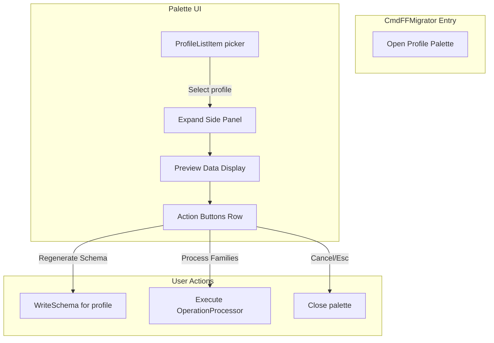

# Family Foundry UI MVP

## Overview

Create a palette-based UI workflow for `CmdFFMigrator`:

1. Profile picker palette (list of profile JSONs with metadata)
2. Expandable side panel showing preview data (replaces PreviewRun flag)
3. Three action buttons: Regenerate Schema, Process Families, Cancel

## Architecture

## Key Files to Modify/Create

| File | Change ||------|--------|| [`Library/PeUi/Components/Palette.xaml(.cs)`](Library/PeUi/Components/Palette.xaml.cs) | **Enhance** - Add sidebar infrastructure with multi-sidebar support || [`Library/PeUi/Core/PaletteFactory.cs`](Library/PeUi/Core/PaletteFactory.cs) | Add `Sidebars` option to `PaletteOptions<T>` || [`LibraryAddins/AddinFamilyFoundrySuite/Cmds/CmdFFMigrator.cs`](LibraryAddins/AddinFamilyFoundrySuite/Cmds/CmdFFMigrator.cs) | Replace current logic with palette-based flow || [`LibraryAddins/AddinFamilyFoundrySuite/Core/BaseSettings.cs`](LibraryAddins/AddinFamilyFoundrySuite/Core/BaseSettings.cs) | Remove `CurrentProfile` property || [`LibraryAddins/AddinFamilyFoundrySuite/Core/OperationProcessor.cs`](LibraryAddins/AddinFamilyFoundrySuite/Core/OperationProcessor.cs) | Remove `PreviewRun` from `ExecutionOptions` || `LibraryAddins/AddinFamilyFoundrySuite/Ui/ProfileListItem.cs` | **New** - IPaletteListItem with profile metadata || `LibraryAddins/AddinFamilyFoundrySuite/Ui/ProfilePreviewPanel.xaml(.cs)` | **New** - Sidebar content for preview display || `LibraryAddins/AddinFamilyFoundrySuite/Ui/ActionButtonRow.xaml(.cs)` | **New** - Three-button row with keyboard nav |

## Implementation Details

### 0. Palette Sidebar Infrastructure (Base Component Enhancement)

**New feature for `Palette.xaml/.cs`:**Add support for multiple collapsible/expandable sidebars that appear to the right of the main list:

- **XAML Layout**: Add a `Grid` column for sidebars (initially collapsed, width=0)
- **Sidebar Registration**: `PaletteOptions<T>` gets new `Sidebars` property - list of sidebar definitions
- **Sidebar Definition**: Each sidebar has:
- `Content`: UserControl to display
- `InitialState`: Collapsed/Expanded
- `Width`: GridLength when expanded
- `ExitKeys`: Keys that close/collapse the sidebar (e.g., Escape)
- **Keyboard Nav**: Sidebars respect focus hierarchy - Esc from sidebar returns focus to main list
- **Multiple Sidebars**: Support stacking multiple sidebars (e.g., preview + settings)

This makes sidebars reusable across all palettes, not just Family Foundry.

### 1. ProfileListItem (IPaletteListItem implementation)

Metadata to display:

- **TextPrimary**: Profile filename (without `.json`)
- **TextSecondary**: `$extends` value (if present) or "Base Profile"
- **TextPill**: Line count (e.g., "142 lines")
- **GetTextInfo**: Created date, Last modified date, full path

CSV state: Store last selected profile and usage count per profile.

### 2. Preview Sidebar Content

Display data from `DryRunResultBuilder.GenerateDryRunData()`:

- Profile name
- Operations list (name, description, batch info)
- APS Parameters count and list
- Families count and list

Triggered via `OnSelectionChanged` callback in `PaletteOptions` - expands the sidebar when a profile is selected.

### 3. Action Button Row

Three buttons with keyboard navigation:

- **Tab/Shift+Tab** or **Left/Right arrows**: Cycle focus between buttons
- **Enter/Space**: Activate focused button
- **Esc**: Cancel and close

Buttons:

1. "Regenerate Schema" - Calls `WriteSchema()` on selected profile
2. "Process Families" - Executes `OperationProcessor.ProcessQueue()`
3. "Cancel" - Closes the palette

### 4. Profile Discovery

Read all `.json` files from `storage.SettingsDir().SubDir("profiles")` path:

- Filter out schema files (`*.schema.json`)
- Parse each to extract `$extends` property