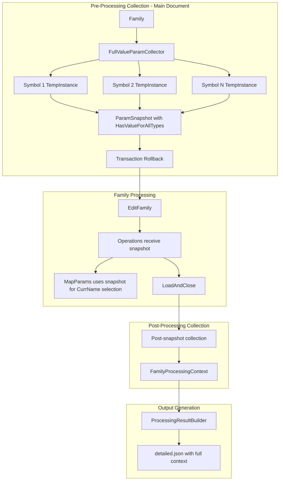

# FamilyFoundry Pre/Post Processing and Logger Refactor (v2)

## Architecture Overview



---

## Phase 1: Extend ParamCollectionResult with Value Metadata

Modify [`LibraryAddins/AddinFamilyFoundrySuite/Core/Aggregators/IFamilyParamCollector.cs`](LibraryAddins/AddinFamilyFoundrySuite/Core/Aggregators/IFamilyParamCollector.cs):

```csharp
public record ParamCollectionResult(
    string ParamName,
    ForgeTypeId DataType,
    bool IsInstance,
    StorageType StorageType,
    bool IsBuiltIn,
    Guid? SharedGuid,
    bool HasValueForAllTypes,  // NEW: true if every type has a non-empty value
    int TypesWithValue,        // NEW: count of types that have a value
    int TotalTypes             // NEW: total type count for context
);
```

---

## Phase 2: Create FullValueParamCollector

Create a new collector or extend [`LibraryAddins/AddinFamilyFoundrySuite/Core/Aggregators/TempInstanceParamCollector.cs`](LibraryAddins/AddinFamilyFoundrySuite/Core/Aggregators/TempInstanceParamCollector.cs) to iterate ALL symbols:

**Key changes:**

1. `GetAllSymbols()` instead of `GetFirstSymbol()`
2. One transaction, loop all symbols, place temp instance for each
3. Track per-param value presence across all types
4. Single rollback at the end
```csharp
public List<ParamCollectionResult> CollectParams(Document doc, Family family) {
    var results = new Dictionary<string, ParamValueTracker>();
    var symbols = GetAllSymbols(family);
    var totalTypes = symbols.Count;
    
    using var tx = new Transaction(doc, "Collect Param Values");
    tx.Start();
    
    try {
        foreach (var symbol in symbols) {
            if (!symbol.IsActive) symbol.Activate();
            var tempInstance = doc.Create.NewFamilyInstance(...);
            
            // Collect instance params (same for all types)
            foreach (var p in tempInstance.GetOrderedParameters()) {
                TrackParam(results, p, isInstance: true, hasValue: !IsEmpty(p));
            }
            
            // Collect TYPE params from this symbol
            foreach (Parameter p in symbol.Parameters) {
                TrackParam(results, p, isInstance: false, hasValue: !IsEmpty(p));
            }
        }
    } finally {
        tx.RollBack();
    }
    
    return results.Values
        .Select(t => t.ToResult(totalTypes))
        .ToList();
}
```


The `TempInstanceParamCollector` can remain for metadata-only use cases (like `CmdFFParamAggregator`), or we can make value collection opt-in via a flag.

---

## Phase 3: Create FamilyProcessingContext

Create [`LibraryAddins/AddinFamilyFoundrySuite/Core/FamilyProcessingContext.cs`](LibraryAddins/AddinFamilyFoundrySuite/Core/FamilyProcessingContext.cs):

```csharp
public class FamilyProcessingContext {
    public required string FamilyName { get; init; }
    
    // Collected before EditFamily() - includes HasValueForAllTypes
    public List<ParamCollectionResult> PreProcessSnapshot { get; set; }
    
    // Collected after LoadAndClose()
    public List<ParamCollectionResult> PostProcessSnapshot { get; set; }
    
    // Populated during processing
    public Result<List<OperationLog>> OperationLogs { get; set; }
    
    public double TotalMs { get; set; }
    
    // Helper for operations to query
    public bool ParamHasValueForAllTypes(string paramName) =>
        PreProcessSnapshot?.FirstOrDefault(p => p.ParamName == paramName)?.HasValueForAllTypes ?? false;
}
```

---

## Phase 4: Make Snapshot Available to Operations

### Option A: Pass via OperationProcessor

Modify [`LibraryAddins/AddinFamilyFoundrySuite/Core/OperationProcessor.cs`](LibraryAddins/AddinFamilyFoundrySuite/Core/OperationProcessor.cs):

1. Add `IFamilyParamCollector` as optional constructor parameter
2. Collect pre-snapshot before `EditFamily()`
3. Store snapshot in a thread-local or pass to operation funcs

### Option B: Introduce ISnapshotAwareOperation interface

Operations that need snapshot data implement:

```csharp
public interface ISnapshotAwareOperation : IOperation {
    void SetPreSnapshot(List<ParamCollectionResult> snapshot);
}
```

The processor checks if an operation implements this interface and injects the snapshot before execution.

**Recommendation:** Option B is cleaner - operations opt-in to receiving snapshot data.

---

## Phase 5: Update MapParams and MapReplaceParams

Modify [`LibraryAddins/AddinFamilyFoundrySuite/Core/Operations/MapParams.cs`](LibraryAddins/AddinFamilyFoundrySuite/Core/Operations/MapParams.cs) and [`LibraryAddins/AddinFamilyFoundrySuite/Core/Operations/MapReplaceParams.cs`](LibraryAddins/AddinFamilyFoundrySuite/Core/Operations/MapReplaceParams.cs):

1. Implement `ISnapshotAwareOperation`
2. Use snapshot to intelligently select CurrName:
```csharp
// Instead of iterating CurrName in order:
foreach (var currName in mapping.CurrName) { ... }

// Sort CurrName by HasValueForAllTypes first:
var sortedCurrNames = mapping.CurrName
    .OrderByDescending(name => _snapshot.ParamHasValueForAllTypes(name))
    .ThenBy(name => mapping.CurrName.IndexOf(name)); // preserve original order as tiebreaker

foreach (var currName in sortedCurrNames) { ... }
```


---

## Phase 6: Create ProcessingResultBuilder

Create [`LibraryAddins/AddinFamilyFoundrySuite/Core/ProcessingResultBuilder.cs`](LibraryAddins/AddinFamilyFoundrySuite/Core/ProcessingResultBuilder.cs):

```csharp
public class ProcessingResultBuilder {
    private readonly Storage _storage;
    private object _profileSettings;
    private List<FamilyProcessingContext> _familyContexts = [];
    private List<OperationMetadata> _operationMetadata;
    private double _totalMs;
    
    public ProcessingResultBuilder(Storage storage);
    
    public ProcessingResultBuilder WithProfile<T>(T settings) where T : BaseProfileSettings {
        _profileSettings = settings;
        return this;
    }
    
    public ProcessingResultBuilder WithOperationMetadata(OperationQueue queue) {
        _operationMetadata = queue.GetExecutableMetadata();
        return this;
    }
    
    public ProcessingResultBuilder WithFamilyResults(List<FamilyProcessingContext> contexts) {
        _familyContexts = contexts;
        return this;
    }
    
    public ProcessingResultBuilder WithTotalTime(double totalMs) {
        _totalMs = totalMs;
        return this;
    }
    
    public string WriteOutput(bool openOnFinish);
}
```

---

## Phase 7: New Output Schemas

**Abridged Schema** (unchanged - summary only):

- Timestamp, TotalSecondsElapsed
- Per-family: FamilyName, Success/Total counts, grouped errors

**Detailed Schema** (enhanced):

```json
{
  "Timestamp": "...",
  "TotalSecondsElapsed": 12.34,
  "ProfileSettings": { /* full re-serialized profile */ },
  "OperationMetadata": [ /* queue metadata */ ],
  "ProcessedFamilies": [
    {
      "FamilyName": "MyFamily",
      "PreProcessSnapshot": [
        {
          "ParamName": "Voltage",
          "DataType": "autodesk.spec.aec:voltage-1.0.0",
          "IsInstance": false,
          "HasValueForAllTypes": true,
          "TypesWithValue": 3,
          "TotalTypes": 3
        }
      ],
      "PostProcessSnapshot": [ /* same structure */ ],
      "Operations": [
        {
          "OperationName": "MapParams",
          "SecondsElapsed": 0.5,
          "Successes": [...],
          "Errors": [...]
        }
      ]
    }
  ]
}
```

---

## Phase 8: Update Commands

Update [`LibraryAddins/AddinFamilyFoundrySuite/Cmds/CmdFFManager.cs`](LibraryAddins/AddinFamilyFoundrySuite/Cmds/CmdFFManager.cs) and related commands:

```csharp
var collector = new FullValueParamCollector(); // or extended TempInstanceParamCollector
using var processor = new OperationProcessor(doc, executionOptions, collector);

var results = processor
    .SelectFamilies(...)
    .ProcessQueue(queue, outputFolderPath, loadAndSaveOptions);

new ProcessingResultBuilder(storage)
    .WithProfile(profile)
    .WithOperationMetadata(queue)
    .WithFamilyResults(results.familyContexts)
    .WithTotalTime(results.totalMs)
    .WriteOutput(settings.OnProcessingFinish.OpenOutputFilesOnCommandFinish);
```

---

## Files Changed Summary

| File | Change |

|------|--------|

| `Core/Aggregators/IFamilyParamCollector.cs` | Extend `ParamCollectionResult` with value metadata |

| `Core/Aggregators/TempInstanceParamCollector.cs` | Add multi-symbol iteration for value collection |

| `Core/FamilyProcessingContext.cs` | **NEW** - Context with pre/post snapshots |

| `Core/ProcessingResultBuilder.cs` | **NEW** - Builder for output generation |

| `Core/BaseOperation.cs` | Add `ISnapshotAwareOperation` interface |

| `Core/OperationProcessor.cs` | Inject collector, pass snapshots to operations |

| `Core/Operations/MapParams.cs` | Implement snapshot-aware CurrName selection |

| `Core/Operations/MapReplaceParams.cs` | Implement snapshot-aware CurrName selection |

| `Core/OperationLogger.cs` | Deprecate static methods |

| `Cmds/CmdFFManager.cs` | Use new collector and builder |

---

## Design Decisions

1. **Multi-symbol temp instance is faster than TypeOperation** - Collect all type values in main document via temp instances + rollback
2. **ISnapshotAwareOperation is opt-in** - Only operations that need snapshot data implement the interface
3. **Original TempInstanceParamCollector preserved** - Aggregator command can continue using metadata-only collection
4. **CurrName selection uses snapshot** - Prioritize params that have values for all types